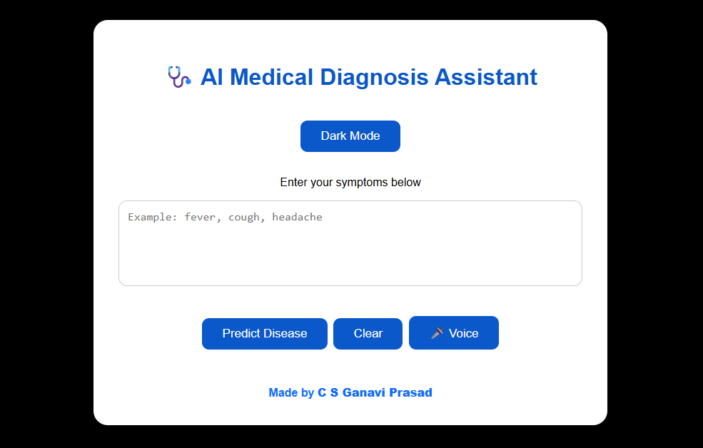
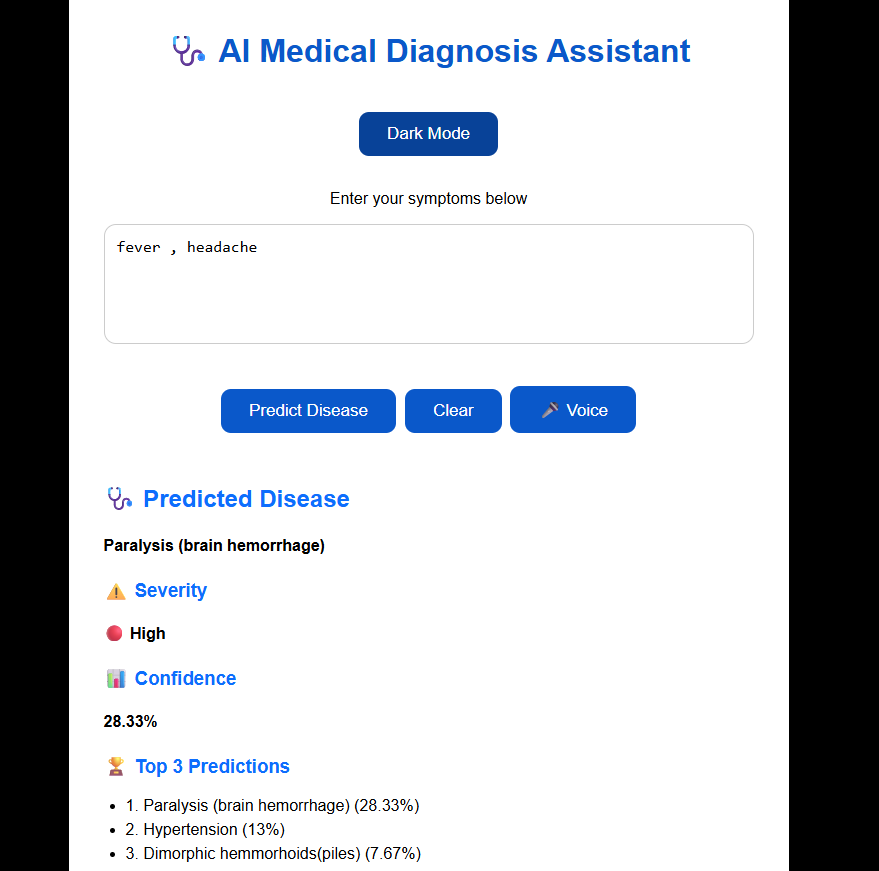
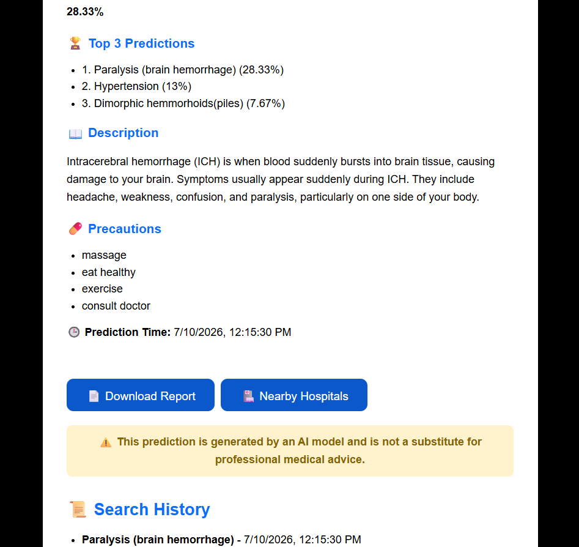
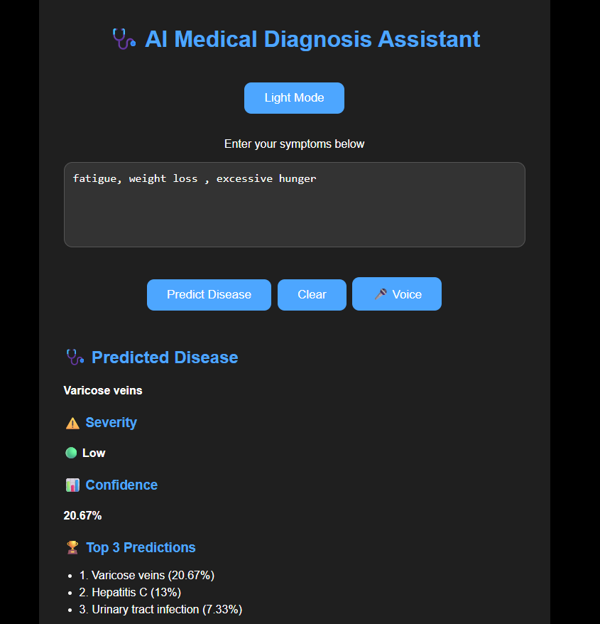
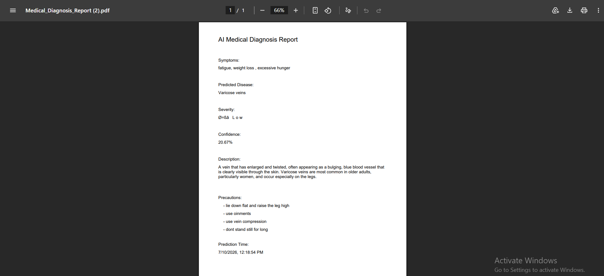
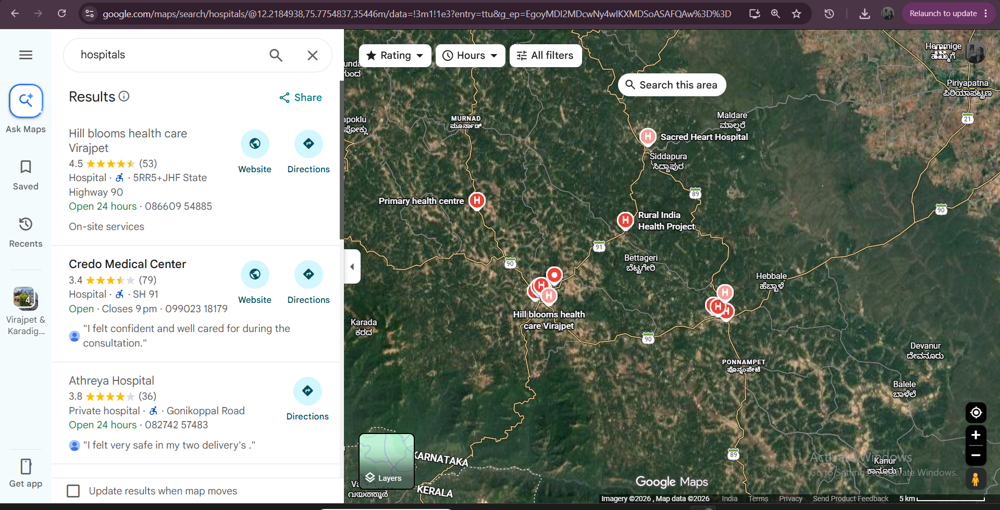

# AI Medical Diagnosis Assistant

## Overview

AI Medical Diagnosis Assistant is a full-stack web application that predicts possible diseases based on user-entered symptoms using a Machine Learning model. The application provides disease predictions with confidence scores, severity levels, descriptions, recommended precautions, voice input support, downloadable PDF reports, and nearby hospital search.

---

## Features

- Disease prediction based on symptoms
- Top 3 predicted diseases with confidence scores
- Disease severity classification (High, Medium, Low)
- Disease description
- Recommended precautions
- Voice input for symptom entry
- Downloadable PDF diagnosis report
- Dark Mode and Light Mode
- Search history
- Nearby hospital search using Google Maps
- Input validation for empty and invalid symptoms

---

## Technology Stack

### Frontend

- React.js
- JavaScript
- HTML5
- CSS3
- Axios
- jsPDF

### Backend

- Flask
- Python
- Flask-CORS

### Machine Learning

- Scikit-learn
- Random Forest Classifier
- Pandas
- Joblib

### Dataset

- Disease-Symptom Dataset

---

## Project Structure

```text
AI-Medical-Diagnosis-Assistant
│
├── backend
│   ├── app.py
│   └── train_model.py
│
├── frontend
│   ├── public
│   ├── src
│   ├── package.json
│   └── package-lock.json
│
├── dataset
│   ├── dataset.csv
│   ├── symptom_Description.csv
│   ├── symptom_precaution.csv
│   └── Symptom-severity.csv
│
├── model
│   ├── disease_model.pkl
│   └── symptom_encoder.pkl
│
├── screenshots
│   ├── home.png
│   ├── prediction.png
│   ├── prediction-details.png
│   ├── darkmode.png
│   ├── report.png
│   └── nearby-hospitals.png
│
└── README.md
```

## Installation

### Clone the Repository

```bash
git clone https://github.com/ganavics/AI-Medical-Diagnosis-Assistant.git

cd AI-Medical-Diagnosis-Assistant
```

### Backend Setup

```bash
cd backend

pip install -r requirements.txt

python app.py
```

### Frontend Setup

```bash
cd frontend

npm install

npm start
```

The application will run at:

- Frontend: http://localhost:3000
- Backend: http://127.0.0.1:5000

---

## Screenshots

### Home Page



### Disease Prediction



### Prediction Details



### Dark Mode



### PDF Report



### Nearby Hospitals


---

## Future Enhancements

- User authentication
- Medical report history
- Online doctor consultation
- Multi-language support
- Cloud deployment
- Deep learning-based disease prediction

---

## Author

**C S Ganavi Prasad**

GitHub: https://github.com/ganavics
